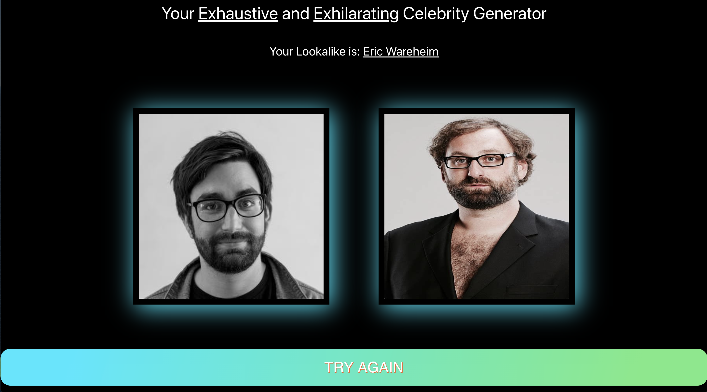

# Celebrity Lookalike Generator

## Introduction

This react app was created for my second General Assembly project. This project was completed hackathon style in 48 hours with [Eleanor Byass](https://github.com/ebyass "Eleanor's Github"). The project is deployed with Netlify. This app was great fun so please feel free to have a go [here](https://find-your-celebrity-lookalike.netlify.app "Celebrity Lookalike Generator")

## Contents
* [Introduction](#Introduction)
* [Contents](#Contents)
* [Project Brief](#Brief)
* [The APIs](#The-APIs)
  * [Luxand Cloud](#Luxand-Cloud-Celebrity-Recognition-API)
  * [Microsoft Azure](#Microsoft-Azure-Cloud-Bing-Image-Search-API)
* [Planning and Process](#Planning-and-Process)
* [Wins and Blockers](#Wins-and-Blockers)
  * [Wins](#Wins)
  * [Challenges](#Challenges)
* [Future Features](#Future-Features)
* [Conclusion](#In-Conclusion)

## Brief
Consume at least one public API into a React application to create a fun or useful product.

## How it Works
The basic function of the app is that a user provides us with a URL of their photograph, we then determine which celebrity that they look like and then we display a picture of that celebrity next to the user's image.


Clicking on GO FIND MY CELEBRITY will then take you to the result page:



## Using it Yourself
To run this app on your local machine you will need to download or clone the files and then sign up for two APIs, The first is [Luxand Cloud](https://rapidapi.com/aboykov/api/luxand-cloud-face-recognitionendpoint=apiendpoint_188c3cc8-6f87-4558-a9c7-be772a5a7ccf) and the second is [Microsoft Azure](https://azure.microsoft.com/en-gb/free/).

I assume that you have an up to date version of Yarn or NPM installed

* Fork and Clone the Repository
* `$ cd` into the project directory
* `$ yarn` or `$ npm install` to install dependencies
* `$ echo REACT_APP_RAPID_KEY=[YOUR LUXAND CLOUD RAPID API KEY] >> .env` to create and add first API key
* `$ echo REACT_APP_AZURE_KEY=[YOUR MICROSOFT AZURE API KEY] >> .env` to add second key
* `$ yarn start` or `$ npm run start`to start react server

## The APIs
### Luxand Cloud Celebrity Recognition API
We used this API to generate the name of a celebrity that the user looks most like. This API is designed to pick out actual known celebrities in an image, however a quirk of it is that even if the tested image is not that of a celebrity, it will usually return the closest match.

### Microsoft Azure Cloud Bing Image Search API
We decided to use the Bing image search API to go and fetch an image of the lookalike celebrity. Although other search engines offer similar APIs, our testing showed that Bing was the most reliable when searching for less well-known celebrities using only their name as a search term.

## Planning and Process
The first API that we liked the look of and decided to use was the Luxand Cloud Celebrity Recognition API. Having the ability to find the name of the closest looking celebrity is fine but for it to become a fun app to use we needed to find a way of producing an image of the resulting Celebrity.
We initally looked at using image specific APIs from Pexels and unsplash but these sites only host a handful of images that would be suitable for us. Getty images was our next possibility however they do not make it easy to sign up. We realized that what we actually needed was to somehow return the first result from an image search engine. We decided on using Bing as this returned the best results when searching for the name of the celebrity in question.

Below is the chain of events that happen as soon as the component mounts:
```javascript
async componentDidMount() {
  try {
    this.setState({ userImage: this.props.location.state.userImage })
    this.shufflePictures()
    this.getCelebName()
  } catch (err) {
    console.log(err)
  }
}
```
Firstly we take the user's image and set it into state so that the image is rendered to the left hand pane.
Secondly we set off aloop of pre chosen pictures to act as a loading spinner for the API responses to arrive
Then we get the celebrity lookalike name from Luxand Cloud.

```javascript
getCelebName = async () => {
  try {

    const res = await getLookalike(this.props.location.state.userImage)

    this.setState({ lookalike: res.data.result[0].name })
    this.getCelebImage()
  } catch {
    // Sets Fallback image and text feedback to the user if we get no response from Luxand
    this.setState({ lookalike: 'No Idea, try another image' })
    this.setState({ celebImage: 'https://s3.amazonaws.com/pix.iemoji.com/images/emoji/apple/ios-12/256/woman-shrugging.png' })
  }
}
```
Assuming everything goes well we then immediately pass the name of the celebrity as a string to Bing's image search.
If something doesn't work as expected we prompt the user to have another go with a different image.

```javascript
getCelebImage = async () => {
  try {
    const celeb = this.state.lookalike
    const res = await getImage(celeb)
    this.setState({ celebImage: res.data.value[0].thumbnailUrl })
  } catch (err) {
    console.log(err.response)
  }
}
```
The shuffle images simply works by using a setInterval function to loop through a predefined array of images that stops itself once a response is recieved from Luxand.

```javascript
shufflePictures = () => {
  let i = 0
  const shuffle = setInterval(() => {
    if (this.state.lookalike) {
      clearInterval(shuffle)
      return
    }
    this.setState({ celebImage: this.state.stockImages[i] })
    if (i === this.state.stockImages.length - 1) {
      i = 0
    } else {
      i++
    }
  }, 300)
}
```

## Wins and Blockers

#### Wins
A real win here was finding and using the Bing Search API, although the app could have functioned by simply telling the user the name of their celebrity lookalike, having the photograph for comparison makes this an app that a user would enjoy using with their friends.

I also feel that Eleanor and I worked really well together using VScode Liveshare.

#### Challenges
We had some trouble getting the timing of everything to work. As we needed to take the data from an initial response and then pass this to another API getting the asynchronous functions to work as required was a challenge. Initially we set a timeout on searching for an image however we found that this was unnecessary in the end.

Unfortunately we had some issues with poor internet connection so VS code sometimes didn't work well. This meant that we needed to keep in constant contact using Slack and Zoom to ensure that we were always on the same page.

## Future Features
Ideally, we would have the user upload an image of themselves instead of providing a URL, however as this was simply a novelty web app, we decided a URL would be sufficient enough.

## In Conclusion
This was great fun to create and I think that we have a fun and useable app.